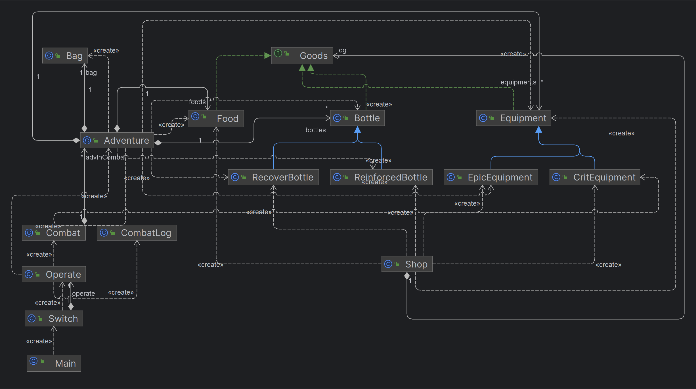

# 2023BUAA-oopre结课总结
## 1.作业架构设计
最终迭代之后的逻辑架构  :

### 1.1.历次迭代中的架构调整    
在整个迭代的过程中，我并没有出现大量的代码重构，几乎都是在原有代码的基础上继续添加新的功能。  

第二次作业中只有`Main`、`Adventure`、`Equipment`、`Bottle`四个类。在此基础上，第三次作业增加了`Food`类，还使用`Bag`类来记录冒险者携带的物品，`Bag`中仅仅记录相关物品的`id`。

第四次作业加入了`Combat`和`CombatLog`分别来处理战斗过程并记录战斗信息，其实现在看来`Combat`可以采用单例模式，只不过当时还没接触到。

第六次作业给添加了`Equipment`、`Bottle`添加了几个子类，并增加`Commodity`接口(~~我没做~~)。第七次作业我加入了单例模式的`Shop`类，并为三类物品添加`Goods`接口方便统一管理。
### 1.2.输入解析的调整
最开始我的输入和处理的过程都是在`Main`中完成的，后来随着指令的不断增多，`Main`中方法超出了行数的限制，于是我把输入解析的过程单独组建了一个`Switch`类，使用`if-else`语句将不同指令分配给`Operation`下的不同方法进行操作。但是随着指令的继续增多，这种方法最后可能也会出现问题。最后，我学习了老师在群中发的一篇文章，采用表驱动编程模式，借助`Comsumer`构建一个`HashMap`，将输入的序号和操作建立一个映射关系，这种做法大大减小了方法的长度。（不过其实我并没有把这种方法应用到我的代码中，因为迭代完最后一次我的`Switch`中的方法为54行，可能如果再增加一些指令就需要调整了。）
### 1.3.架构的不足
其实到最后两次作业的时候，我能够感觉到代码有一定的冗余的。巨大的`Adventure`类中有350行代码，许许多多的方法堆积在里面。如果让我重新在构建一遍结构，我会更好地利用继承、接口等工具，处理好类与类之间的关系，而不是生硬地使用。
## 2.使用junit的心得体会
我也是第一次使用这种工具对自己的程序进行模块化的检测。虽然写juint测试程序有时候很复杂，但它确实能帮助我检查出来一些问题，在提交评测机之前自己先检查一遍，大大减少了出现bug的可能。同时，juint提供的各种覆盖率，也有助于我们对代码进行更加全面的检测，在构造测试样例的过程中，我会尽可能去考虑到指令的不同情况。不过juint也不是万能的，很多bug可能我自己设计样例的时候也没有考虑到，一般能想到的bug在写程序的时候都尽量去避免了。自己写juint程序确实容易陷入自己的思维模式中。
## 3.学习oopre的心得体会
### 3.1.从面向过程到面向对象
oopre和之前的C语言程设以及数据结构给我的感觉是有所不同的。拿到一道C语言的题目后，我一般会思考该用什么算法来实现，然后在main函数中来实现，最多写几个自己的函数（可能是因为程设本来就比较侧重算法）。面对几条oopre中的指令时，我会将指令的操作分为几个部分，由不同的模块来完成，有时候可能会新增一些模块，每个模块完成的都是一些简单的工作。这种**模块化**的编程过程是面向对象带给我的一个直观感受。这种方式，不但编程的时候逻辑更加清晰，而且进行程序测试和debug时也更加方便。
### 3.2.规范化的编程过程
oopre课程要求我们按照严格的规范去编程，并设置checkstyle来检查代码风格。这让我体会到了良好的代码风格的好处。在编写程序的时候，我尽量在变量命名等方面做到规范，写出来的程序，即使没怎么写注释，一周之后我也能很快看懂自己上一次作业都写了什么。明确每个变量的含义也让我的编程效率得到提高。代码之间的缩进和空格让程序变得更加美观。以及，我还感受到使用git来管理代码的好处。
## 对oopre课程的简单建议
* 刚开始对git的使用可以讲解的更加详细一点，同时搭配上一些视频实例，~~很多git的操作我现在也没搞明白~~。
* 感觉有些知识的讲解和使用有些生硬，比如Commodity接口，我在最后一次作业中才体会到使用接口的好处。

最后，在oopre这门课中我第一次接触到面向对象，大大提升了我的编程能力，看到自己最终完成的作业，我也非常有成就感，再次感谢老师和助教们的付出。